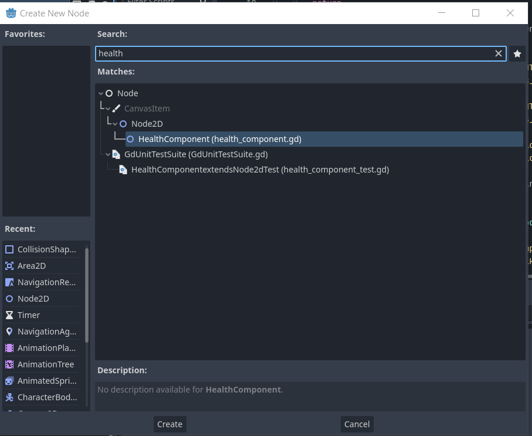
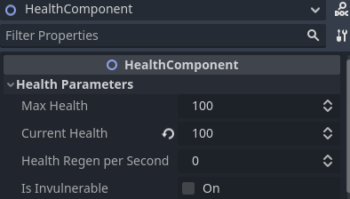

imagen aqui

- - -

Godot 2D essentials is a collection of production ready components to speed up the development of your 2d games. This components handles basic behaviours without affecting the particular logic of your game.

We provide you a few examples on how to use them in the folder **examples** that you can find in this repository

# Requirements
- We only provide support for Godot 4+ versions

# ✨Installation
You can download this plugin from the official [godot asset library](https://godotengine.org/asset-library/asset) or manually download it from this repository directly in your project addons folder
# 🐱‍🏍Getting started
This is nothing more than a collection of new nodes that you can add as a new scene like you usually do when working with the Godot game engine.




# 🐱‍🚀Available components
Here you can find the full available list of components, be sure to read the documentation for each component before use in your project to get the most out of it.
# 💖HealthComponent
This one manages all related to taking damage and health on the parent node, usually you add this to a **CharacterBody2D** but nothing prevents from being used in a **StaticRigidBody2D** if you want to make alive a tree or any other game object.

### Setup
Add this component as a child in which node you want to add a life and damage logic, the next steps are:
- Set the initial values you desire for this component

- (Optional) To enable health regen you need to add a value greater than zero for the parameter `health regen per second`

### Taking damage
Easy as call the function `damage` inside the component, a signal `health_changed` is emitted everytime receives damage while checking if the current health has reached zero, in which case it additionaly emits a `died` signal.

If the variable `is_invulnerable` is true, the damage received will be zero but signals will continue to be broadcast normally.

```python
health_component.damage(10)
```
### Health
The behavior is the exact same as damage but this time add health to the component, it can never reach the `max_health` defined. A signal `health_changed` is emitted everytime this health function is called.

```python
health_component.health(25)
```

### Health regeneration per second
By default, the health regeneration is set to be **every second** and need to be activated as we describe in the Setup section above. When the health component call the function `damage()` the regeneration is enabled until reach the max health where it will be deactivated.
### Invulnerability
You can disable or enable the invulnerability using the function `enable_invulnerability(enable: bool, time: float = 0.05)` passing as parameters if is active and the time in seconds that will be invulnerable where it will be deactivated when reachs the timeout.

```python
health_component.enable_invulnerability(true, 2.5)

# you can deactivating it manually with
health_component.enable_invulnerability(false)

```
### Signals
```python
# You can access the action type in the health_changed signal
# to determine what kind of action was taken and act accordingly to the flow of your game.
enum TYPES {
	DAMAGE,
	HEALTH,
	REGEN
}


signal health_changed(amount: int, type: TYPES)
signal invulnerability_changed(active: bool)
signal died
```


## 🚀VelocityComponent2D
Whether top-down, platformer or grid-based, this component offers the functionality you need without having to rewrite it yourself for each project. The movement can be made flexible with the exposed parameters and contains an internal api that facilitates the most common actions that can occur in a 2d game.

🧇This component does not register inputs, it is a headless component that only applies movement to one node. The logic of when to do this is up to you as the developer.