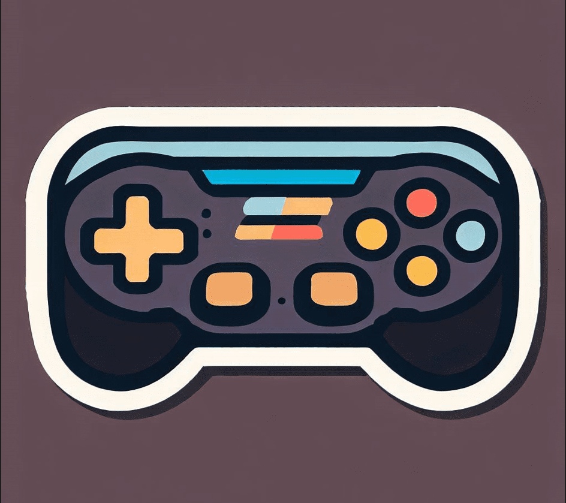

	

- - -

Godot 2D essentials is a collection of production ready components to speed up the development of your 2d games. This components handles basic behaviours without affecting the particular logic of your game.

We provide you a few examples on how to use them in the folder **examples** that you can find in this repository

# Requirements
- Godot 4+

# ✨Installation
## Automatic (Recommended)
You can download this plugin from the official [godot asset library](https://godotengine.org/asset-library/asset) using the AssetLib tab in your godot editor. Install it and you're ready to go
##  Manual 
Create an addons folder in the root of your godot project and download the content from the repository addons folder
# 🐱‍🏍Getting started
This is nothing more than a collection of new nodes that you can add as a new scene like you usually do when working with the Godot game engine. They were designed to be flexible enough to adapt to what your game mechanics are looking for and not intervene in decisions that may affect the implementation of the mechanics of your particular game.
# Official documentation
To understand in detail and see some examples of use visit the [official documentation](https://godot-essentials.gitbook.io/addons-documentation/) where you can find all the information you need.
